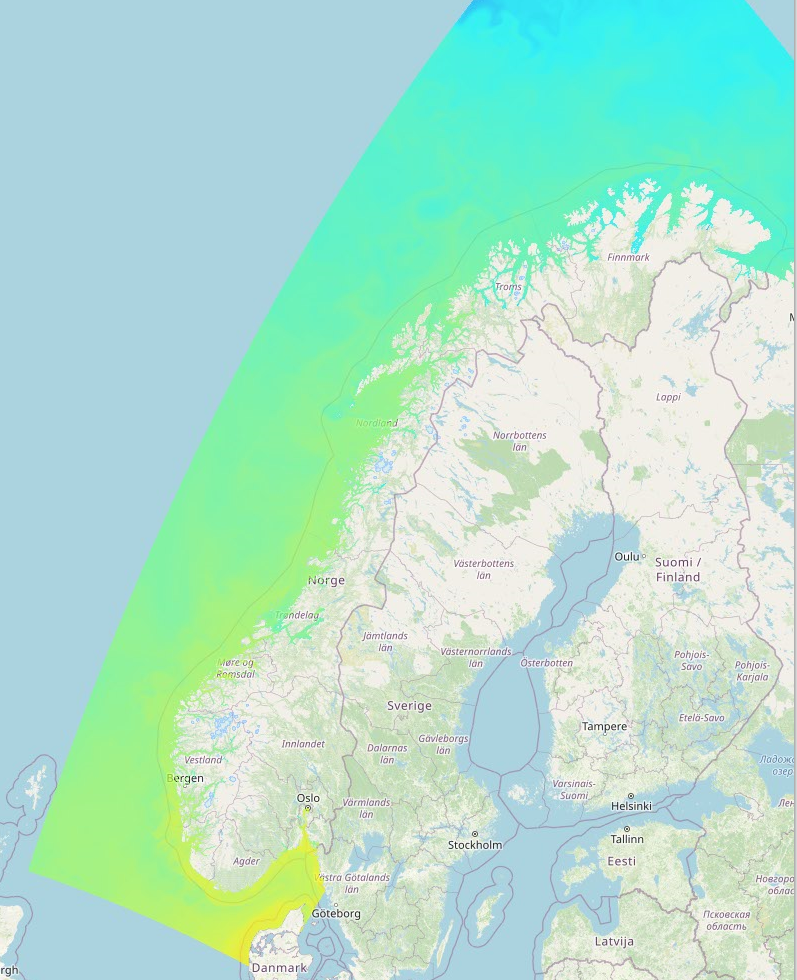

# Hav og vind for Home Assistant

**English** · [Norsk](README.md)

A modern and user-friendly integration for bringing **weather, ocean and tide data**
from **MET Norway**, **Havvarsel** and **Kartverket** into Home Assistant.

This integration lets you:
- add **multiple locations**
- select an **active station** via a dropdown
- use **proxy sensors** that automatically follow the selected station
- display both **current values and forecasts** for wind, waves, currents, temperature, salinity and tides

This is a *custom component* fully configured through the Home Assistant UI —  
no YAML required for basic setup.

---

## Features

### 🌍 Multiple locations
- Add as many locations as you like (one config entry per place)
- Each location gets its own set of sensors based on coordinates

### 📍 Active station (global)
- One global dropdown: **“Active station”**
- The proxy sensors (`sensor.hav_vind_*`) always show data from the selected station
- Perfect for dashboards, graphs and automations that should be station-independent

### 🌬️ Weather (MET Norway)
- Wind speed  
- Wind gust  
- Wind direction  
- Air temperature  
- Relative humidity  
- Air pressure (MSL)  
- Cloud cover  
- Precipitation (1h)  
- Forecasts for most values  

### 🌊 Ocean (MET + Havvarsel)
- Sea temperature (primarily from Havvarsel, fallback to MET Ocean)
- Current speed and current direction
- Significant wave height and wave direction
- Salinity
- Forecasts where available

### 🌒 Tides (Kartverket)
- Current value / prediction
- Forecast series
- Observations (where available)
- Series are automatically trimmed to avoid Home Assistant attribute size limits

### 🧭 Proxy sensors (for dashboards)
Examples:
- `sensor.hav_vind_vindhastighet`
- `sensor.hav_vind_sjotemperatur`
- `sensor.hav_vind_bolgehoyde`
- `sensor.hav_vind_tidevann`

These automatically follow the selected **Active station**.

---

## 📥 Requirements

- Home Assistant 2024.x or newer  
- HACS installed (recommended)

---

## 📦 Installation (HACS)

1. Open **HACS → Integrations**
2. Search for **Hav og vind**
3. Click **Install**
4. Restart Home Assistant if required

---

## ⚙️ Configuration

1. Go to **Settings → Devices & Services**
2. Click **Add integration**
3. Search for **Hav og vind**
4. Enter:
   - Location name
   - Latitude
   - Longitude
5. Finish

Repeat to add more locations if needed.

### Change update interval
- Go to **Settings → Devices & Services → Hav og vind → Configure**
- Adjust **Update interval (minutes)**

---

## 📊 Sensors and devices

Each location is created as its own **Device** in Home Assistant, with sensors for:
- Weather (MET)
- Ocean (MET + Havvarsel)
- Tides (Kartverket)

In addition, the integration creates:
- One global **“Active station”** select entity
- A set of **proxy sensors** (`sensor.hav_vind_*`) that follow the selected station

---

## 🧠 Data sources

- **MET Norway** – weather and ocean (OceanForecast)
- **Havvarsel** – sea temperature and salinity
- **Kartverket** – tide data

All data is fetched directly from public, open APIs.

---

## 🛠 Troubleshooting

- Check **Settings → System → Logs** for:
- If a sensor is `unavailable`, check:
- That a station is selected
- That the API provides data for the area
- Network / internet connectivity

---

## 🙏 Acknowledgements

Developed and maintained by [@Howard0000](https://github.com/Howard0000).  
AI assistant used for troubleshooting and documentation.

---

## 📄 License

MIT License

---

## 🏷 Trademarks and names

- **MET Norway**, **Kartverket** and **Havvarsel** names and services belong to their respective owners  
- Used here only to identify data sources

This is an unofficial community project and is not developed, supported or endorsed by
MET Norway, Kartverket or Havvarsel.

---

## ⚠️ Disclaimer

This integration provides **information and decision support** based on public data sources.

Use at your own risk.  
Data may be delayed, incomplete or incorrect.

Do not rely on this integration as the sole decision basis for safety-critical purposes
(marine operations, weather-critical activities, etc.).

